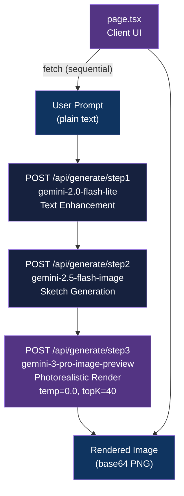

<div align="center">

# AI Studio by AdityoLab

[](https://nextjs.org/)
[](https://www.typescriptlang.org/)
[](LICENSE)
[](https://vercel.com)

**Next.js app that generates photorealistic interior renders from text via a 3-stage Gemini pipeline: enhance, sketch, render**

[Getting Started](#getting-started) | [Usage](#usage) | [Architecture](#architecture)

</div>

---

## Table of Contents

- [The Problem](#the-problem)
- [Features](#features)
- [Tech Stack](#tech-stack)
- [Architecture](#architecture)
- [Getting Started](#getting-started)
  - [Prerequisites](#prerequisites)
  - [Installation](#installation)
  - [Configuration](#configuration)
- [Usage](#usage)
- [How It Works](#how-it-works)
- [API Reference](#api-reference)
- [Architectural Decisions](#architectural-decisions)
- [Project Structure](#project-structure)
- [Deployment](#deployment)
- [Related Projects](#related-projects)
- [License](#license)
- [Author](#author)

## The Problem

### Interior Design Visualization Without 3D Modeling

Producing high-quality interior renders traditionally requires expensive 3D modeling software, specialized skill, and long iteration cycles. Designers and clients cannot quickly visualize concepts from a simple room description.

### The Solution

This app feeds a plain-text room description through a three-stage Gemini pipeline: prompt enhancement, sketch synthesis, and photorealistic rendering. The result is a V-Ray-quality render in seconds, with no modeling software required.

## Features

- **3-stage AI pipeline** - text description flows through enhancement, sketch, and render stages automatically
- **Deterministic rendering** - `temperature: 0.0` on the final stage locks sketch-to-render alignment to near 1:1
- **Model-per-stage selection** - lighter models handle fast text and sketch tasks; `gemini-3-pro-image-preview` handles the high-fidelity render
- **Vercel-ready** - `vercel.json` targets the `iad1` region; deploy from the dashboard with one env variable
- **Live progress feedback** - the UI steps through `step1 -> step2 -> step3 -> complete` states as each API call resolves

## Tech Stack

| Component | Technology |
|-----------|------------|
| Framework | Next.js 14 (App Router) |
| Language | TypeScript 5.5 |
| Styling | Tailwind CSS 3.4 |
| AI Models | Gemini 2.0 Flash Lite, Gemini 2.5 Flash Image, Gemini 3 Pro Image Preview |
| Deployment | Vercel (region: iad1) |

## Architecture



## Getting Started

### Prerequisites

- Node.js 18+
- Google AI Studio API key ([get one here](https://aistudio.google.com/apikey))

### Installation

1. Clone the repository:
   ```bash
   git clone https://github.com/adityonugrohoid/google-ai-studio.git
   cd google-ai-studio
   ```

2. Install dependencies:
   ```bash
   npm install
   ```

### Configuration

Create a `.env.local` file in the root:

```bash
GOOGLE_AI_API_KEY=your_api_key_here
```

## Usage

Start the development server:

```bash
npm run dev
```

Open [http://localhost:3000](http://localhost:3000), enter a room description (e.g., "modern minimalist living room"), and click **Generate Design**. The UI steps through each stage and displays the final photorealistic render.

## How It Works

### 1. Text Enhancement (`step1` - `gemini-2.0-flash-lite`)

The base prompt ("modern living room") is expanded into a detailed architectural description with material specs, lighting cues, and spatial proportions. This ensures the downstream image models have structured, contextual input.

### 2. Sketch Generation (`step2` - `gemini-2.5-flash-image`)

The enhanced prompt is converted into a black-and-white architectural line sketch. This stage separates composition and layout from final rendering, giving step3 a concrete structural reference.

### 3. Photorealistic Rendering (`step3` - `gemini-3-pro-image-preview`)

The sketch image plus enhanced prompt are passed to Gemini's text-and-image-to-image API with a tuned generation config:

| Parameter | Value | Effect |
|-----------|-------|--------|
| `temperature` | `0.0` | Deterministic output; near 1:1 sketch alignment |
| `topP` | `1.0` | Full vocabulary access for quality |
| `topK` | `40` | Balanced creativity vs. accuracy |

`gemini-3-pro-image-preview` was chosen over `gemini-2.5-flash-image` here because the Flash model introduces occasional creativity drift, breaking strict sketch correspondence.

## API Reference

### Endpoints

| Method | Endpoint | Description |
|--------|----------|-------------|
| `POST` | `/api/generate/step1` | Expand a base prompt into a detailed architectural description |
| `POST` | `/api/generate/step2` | Generate a B&W sketch from an enhanced prompt |
| `POST` | `/api/generate/step3` | Transform a sketch into a photorealistic render |

### POST `/api/generate/step1`

**Request:**
```json
{ "basePrompt": "modern living room" }
```
**Response:**
```json
{ "enhancedPrompt": "Detailed architectural description..." }
```

### POST `/api/generate/step2`

**Request:**
```json
{ "enhancedPrompt": "Detailed architectural description..." }
```
**Response:**
```json
{ "imageData": "data:image/png;base64,..." }
```

### POST `/api/generate/step3`

**Request:**
```json
{ "sketchImageData": "data:image/png;base64,..." }
```
**Response:**
```json
{ "imageData": "data:image/png;base64,..." }
```

## Architectural Decisions

### 1. Sequential API calls in the client (not a server-side orchestrator)

**Decision:** `page.tsx` calls step1, step2, and step3 in sequence via `fetch`, piping each response into the next call.

**Reasoning:** Keeping orchestration in the client avoids long-running serverless function timeouts (Vercel's 60s default per route). Each route completes independently and returns fast. The trade-off is that the client holds intermediate state; acceptable for a single-user design tool with no concurrency requirement.

### 2. Model assignment per stage

**Decision:** Three different Gemini models rather than one model for all stages.

**Reasoning:** `gemini-2.0-flash-lite` is fast and cheap for pure text tasks. `gemini-2.5-flash-image` is efficient for sketch generation where some creative latitude is acceptable. `gemini-3-pro-image-preview` is reserved for the final render, where 1:1 sketch fidelity is required - the Pro model's stronger instruction following eliminates the creativity drift observed with Flash on the image-to-image task.

### 3. `temperature: 0.0` on the render stage only

**Decision:** Deterministic sampling is applied only to step3, not to steps 1 or 2.

**Reasoning:** Text enhancement and sketch generation benefit from some variability to produce richer descriptions and natural line variation. The render stage must match the sketch exactly, so full determinism is appropriate there.

## Project Structure

```
google-ai-studio/
├── app/
│   ├── api/
│   │   └── generate/
│   │       ├── step1/route.ts     # Text enhancement via gemini-2.0-flash-lite
│   │       ├── step2/route.ts     # Sketch generation via gemini-2.5-flash-image
│   │       └── step3/route.ts     # Render via gemini-3-pro-image-preview (temp=0.0)
│   ├── globals.css
│   ├── layout.tsx
│   └── page.tsx                   # Client UI with step-state machine
├── public/
├── vercel.json                    # Vercel config (region: iad1)
├── package.json
├── next.config.js
├── tailwind.config.js
└── tsconfig.json
```

## Deployment

### Local Development

```bash
npm run dev
```

### Vercel

1. Import the repository at [vercel.com/new](https://vercel.com/new).
2. Add the environment variable:
   - `GOOGLE_AI_API_KEY` - your Google AI Studio API key
3. Deploy. Vercel detects Next.js automatically; `vercel.json` sets the region to `iad1`.

## Related Projects

| Project | Description |
|---------|-------------|
| [google-cloud-ai-studio](https://github.com/adityonugrohoid/google-cloud-ai-studio) | Python/Streamlit sibling - same 3-stage Gemini pipeline, deployed on Cloud Run instead of Vercel |

## License

This project is licensed under the [MIT License](LICENSE).

## Author

**Adityo Nugroho** ([@adityonugrohoid](https://github.com/adityonugrohoid))
